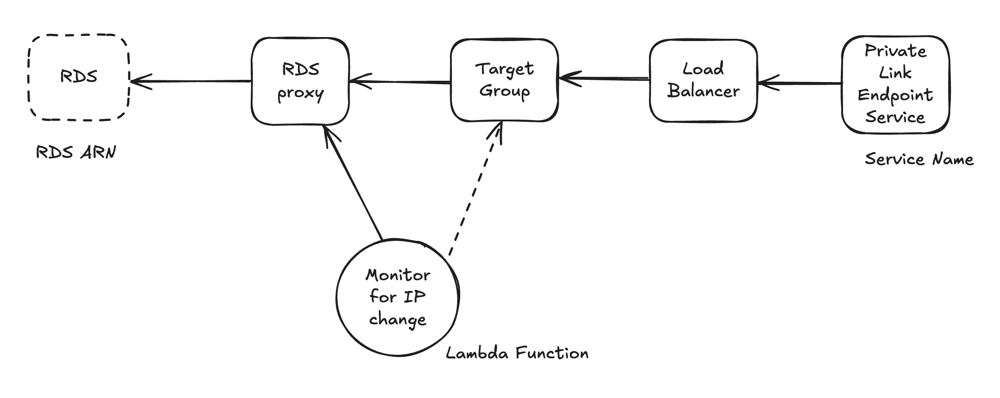

# Control Plane RDS Producer Terraform Modules

Terraform configuration that exposes an Amazon RDS PostgreSQL database to [Control Plane](https://controlplane.com) over AWS PrivateLink. It builds the "producer" side of the connection: an RDS Proxy in front of the database, a Network Load Balancer in front of the proxy, and a VPC Endpoint Service that Control Plane connects to from its own AWS account.

Works with a brand-new database (created for you) or an existing RDS instance.



## How It Works

1. **RDS Proxy** sits in front of the database and provides connection pooling and fast failover. The proxy authenticates to the database with credentials stored in **Secrets Manager** (RDS Proxy requires this — it cannot use plain-text credentials).
2. A **Network Load Balancer** (internal, TCP :5432) forwards traffic to the proxy.
3. Because the proxy's IP addresses can change, a **Lambda function** runs every minute, resolves the proxy endpoint's DNS name, and keeps the NLB target group registered with the current IPs.
4. A **VPC Endpoint Service (PrivateLink)** exposes the NLB to the Control Plane AWS account, allowing cross-account private connectivity with no VPC peering and no public exposure.

## Deployment Modes

The mode is auto-detected from your inputs:

- **New infrastructure** (no ARNs provided): creates a VPC, two private subnets, a multi-AZ RDS PostgreSQL instance, a Secrets Manager secret, and everything in the list above.
- **Existing infrastructure** (`db_instance_arn` + `secret_arn` provided): reuses your database, its VPC, and its subnets; creates only the proxy, NLB, Lambda, and endpoint service. Provide **both** ARNs — supplying only one is a configuration error.

## Prerequisites

### Required software
- **Terraform** >= 1.11.1 ([download](https://developer.hashicorp.com/terraform/downloads))
- **AWS CLI** >= 2.0 ([download](https://aws.amazon.com/cli/)), authenticated against the target account

Providers (installed automatically by `terraform init`): hashicorp/aws `~> 6.0`, plus the community module [terraform-aws-modules/rds](https://registry.terraform.io/modules/terraform-aws-modules/rds/aws/latest) `~> 7.0` in new-infrastructure mode.

### Required AWS permissions
Your credentials must be able to manage: EC2 (VPC, subnets, security groups), ELBv2 (NLB, target groups), RDS (instances, proxies, parameter/subnet groups), Secrets Manager, Lambda, IAM (roles/policies), EventBridge (CloudWatch Events rules), and VPC Endpoint Services.

### For existing-infrastructure mode
- The RDS instance must already exist and be **available**.
- A Secrets Manager secret must hold the database credentials in exactly this format:

  ```json
  {
    "username": "your_db_username",
    "password": "your_db_password"
  }
  ```

- **Your RDS instance's security group must allow inbound PostgreSQL (5432) from the VPC CIDR** (or from the proxy's security group after the first apply). The proxy is created in a new security group; if the database only trusts specific sources, connections from the proxy will silently hang or fail.

## Configuration

### Inputs

| Variable | Mode | Default | Description |
|---|---|---|---|
| `aws_region` | new | — (required) | Region to deploy into |
| `db_username` | new | — (required) | Master username for the new database |
| `db_password` | new | — (required, sensitive) | Master password for the new database |
| `db_password_version` | new | `1` | Increment to push a changed `db_password` (write-only password versioning) |
| `db_instance_arn` | existing | — (required) | ARN of the existing RDS instance (region is derived from it) |
| `secret_arn` | existing | — (required) | ARN of the existing credentials secret |
| `create_infrastructure` | both | auto | Explicit override of mode auto-detection (rarely needed) |
| `allowed_principal_arn` | both | Control Plane's AWS account | Principal allowed to connect to the endpoint service |
| `vpc_cidr` | new | `10.0.0.0/16` | CIDR for the new VPC |
| `vpc_name` | new | `producer-vpc` | Name tag for the new VPC |
| `subnet_1_name` / `subnet_2_name` | new | `private-subnet-1/2` | Name tags for the two private subnets |
| `rds_instance_class` | new | `db.t3.micro` | Instance class |
| `rds_allocated_storage` | new | `20` | Storage (GB, gp3) |
| `rds_engine_version` | new | `15.18` | PostgreSQL version. AWS retires old minors — pick one currently offered (`aws rds describe-db-engine-versions --engine postgres --query 'DBEngineVersions[].EngineVersion'`) |
| `secret_name` | new | `db-credentials` | Name for the created secret. Note: Secrets Manager keeps deleted names reserved for a recovery window (default 30 days), so re-creating with the same name shortly after a destroy will fail |

### Example `terraform.tfvars`

New infrastructure:

```hcl
aws_region  = "us-west-2"
db_username = "postgres"
db_password = "SecurePassword123!"
```

Existing infrastructure:

```hcl
db_instance_arn = "arn:aws:rds:us-west-2:123456789012:db:my-db"
secret_arn      = "arn:aws:secretsmanager:us-west-2:123456789012:secret:my-secret"
```

`*.tfvars` files are gitignored — keep credentials out of version control.

## Deploy

```bash
terraform init
terraform plan
terraform apply
```

New-infrastructure mode takes ~20–30 minutes (multi-AZ RDS creation dominates).

### Output

| Output | Description |
|---|---|
| `privatelink_service_name` | The VPC Endpoint Service name (`com.amazonaws.vpce.<region>.vpce-svc-…`) for Control Plane |

### Next steps

1. Copy `privatelink_service_name` from `terraform output`.
2. Provide it to Control Plane (see the [Control Plane PrivateLink docs](https://docs.controlplane.com) or contact support) so the consumer-side endpoint can be created. The endpoint service does not require manual acceptance, but only the configured `allowed_principal_arn` may connect.
3. Once the endpoint is up, connect from your Control Plane workloads to the endpoint address on port **5432**.

### Connecting to the database

- **TLS is required.** The proxy is configured with `require_tls = true`; clients must connect with SSL (e.g. `sslmode=require` for PostgreSQL clients).
- Authenticate with the database username and password from the Secrets Manager secret. (The proxy uses Secrets Manager to authenticate to the database; client IAM authentication is not enabled.)

## Module Layout

| Module | Created when | Purpose |
|---|---|---|
| `modules/infrastructure` | new mode | VPC, private subnets, Secrets Manager secret |
| `modules/rds` | new mode | Multi-AZ PostgreSQL instance (wraps terraform-aws-modules/rds v7) |
| `modules/rds-proxy` | always | RDS Proxy, its security group and IAM role |
| `modules/load-balancer` | always | Internal NLB, TCP listener and IP target group on 5432 |
| `modules/lambda-function` | always | Python 3.14 Lambda (with vendored [dnspython](https://www.dnspython.org/)) that syncs proxy IPs into the target group every minute |
| `modules/vpc-endpoint` | always | PrivateLink endpoint service restricted to `allowed_principal_arn` |

## Cost Considerations (us-east-1, approximate)

- **RDS instance**: ~$25–100+/month (multi-AZ doubles instance cost; depends on class/storage)
- **RDS Proxy**: ~$0.015/hour per vCPU of the target instance (min 2 vCPU ≈ $22/month)
- **Network Load Balancer**: ~$16–20/month
- **Lambda + EventBridge + Secrets Manager + CloudWatch**: ~$1/month combined

## Troubleshooting

- **`Cannot find version X for postgres`** — that minor version has been retired by AWS; set `rds_engine_version` to a currently offered version (see the CLI query above).
- **Connections hang or time out** — check that the NLB target group has healthy registered targets (the Lambda logs to CloudWatch under `/aws/lambda/cpln_update_target_group_ips`); in existing mode, verify the database security group allows the proxy.
- **"RDS Proxy cannot access Secrets Manager"** — verify the secret ARN and that its value matches the JSON format above.
- **Client connection rejected** — ensure the client connects with TLS enabled.

```bash
terraform validate
terraform plan
```

## Teardown

The RDS instance is created with `deletion_protection = true` and a final snapshot. To destroy: set `deletion_protection = false` in `modules/rds/main.tf`, run `terraform apply`, then `terraform destroy`.

## Support

For issues or questions:
1. Check the troubleshooting section above
2. Review AWS documentation
3. Contact [support@controlplane.com](mailto:support@controlplane.com)
